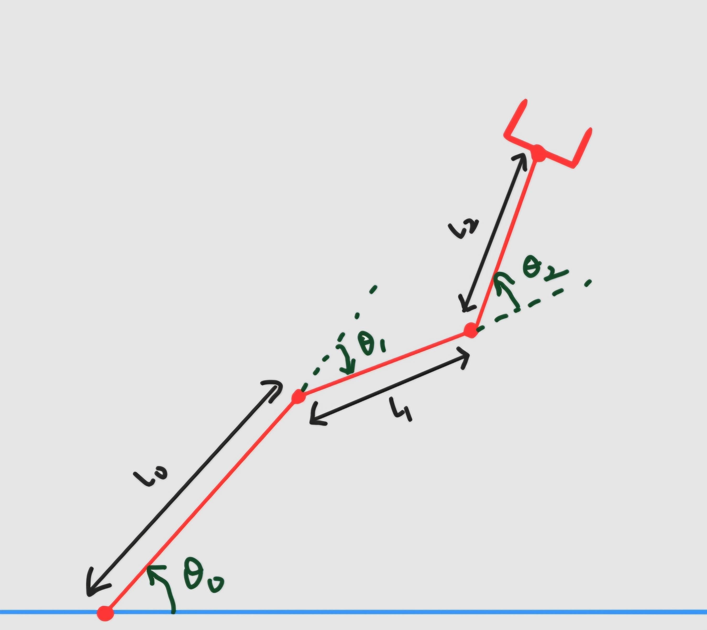

# Planning Challenge

## Objective
The objective of this task is to implement a Path Planner that can perform minimum cost, collision free path planning given a start joint state and a goal joint state. 

## Task Instructions
- Given a planar 3-DOF robotic arm with link lengths [l_0, l_1, l_2], an initial joint configuration [s_0, s_1, s_2], and a target joint configuration [g_0, g_1, g_2], find a sequence of intermediate joint states {[p_a0, p_a1, p_a2], [p_b0, p_b1, p_b2], ...} that moves the arm from the start to the goal configuration without colliding with any obstacles.
- The environment contains circular obstacles defined by their radius and center coordinates, represented as {(r_0, c_0), (r_1, c_1), ...}, where each r_i is the radius and c_i is the center position of the i_th obstacle.
- The solution should ensure that all intermediate joint states correspond to collision-free manipulator configurations with respect to these obstacles.
- Implement the Planning function and collision check function in the [planner.py](./planner.py) under the `FILL IN` comment. You are only allowed to use the modules already imported in [planner.py](./planner.py) for planning and collision checking.
- Each path will be scored as a combination of path length, time taken for planning and collision costs.

	

## Submission
- Submit the `planner.py` file.